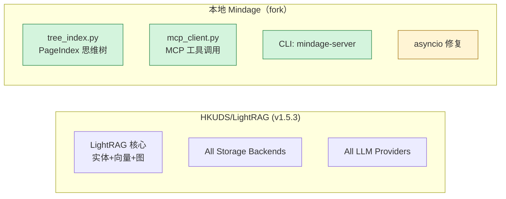

# Mindage vs 上游 LightRAG — 5 分钟看懂差异

> 副标题：你只需要知道**它从 LightRAG 改了什么、还能让你立刻跑起来对比**。

---

## TL;DR（一句话版本）

> **Mindage = LightRAG（v1.5.x） + PageIndex 思维树 + MCP 工具调用 + 一个新名字。**

三个新增能力、零删除核心算法、所有老 LightRAG 文档/示例 100% 兼容。

---

## 1. 项目身份变了

| 维度 | 上游 LightRAG | 本地 Mindage |
|------|---------------|-------------|
| 包名（`pip install`） | `lightrag-hku` | `mindage` |
| CLI 命令 | `lightrag-server` | `mindage-server` |
| 模块路径 | `lightrag.*` | **`lightrag.*`（没改）** ← 关键 |
| WebUI 标题 | "LightRAG" | "Mindage" |

**为什么这很重要：** 改了名字但**模块路径没动**，所以你以前写的 `from lightrag import LightRAG` 全部还能直接跑。改了名字只是为了发自定义 pip 索引 + 给 GitHub 项目一个独立名字（`github.com/RangerCao/mindage`）。

---

## 2. 三个新能力（核心改动）

### 🌲 2.1 PageIndex 思维树 — 你的文档现在有"骨架"了

LightRAG 只给你**图**（实体-关系），Mindage 多给你**树**（章节-段落）。
文档上传后，会同时存到：

```
{working_dir}/
├── kv_store_*.json          ← 老 LightRAG 数据
├── vdb_*.json
├── graph_*.graphml
└── tree_index/                ← 🆕 Mindage 新增
    ├── {doc_id}.json         # 每文档一棵 PageIndex 树
    └── ...
```

**涉及的代码（5 个文件）：**

| 文件 | 干什么 | 行数 |
|------|-------|------|
| `lightrag/tree_index.py` | `TreeIndexStorage` 类 + PageIndex 调度 | 908 |
| `lightrag/tree_search.py` | 树遍历搜索 | 158 |
| `lightrag/api/tree_routes.py` | REST: `GET /tree/list`、`GET /tree/{doc_id}`、`POST /tree/{doc_id}/expand`、`DELETE /tree/{doc_id}` | 235 |
| `lightrag/api/explore_routes.py` | REST: `POST /tree/explore/*`（**注意必须在 `tree_routes` 之前注册**，否则 `/tree/explore/init` 会被 `/tree/{doc_id}` 抢走） | 795 |
| `lightrag_webui/src/features/TreeViewer.tsx` + `TreeMindExplore.tsx` | 可视化 | — |

**怎么验证它真在工作：** 在 WebUI 上传任意文档 → 切到「Tree」标签 → 应该能看到目录树。
或者直接 `curl`：

```powershell
Invoke-RestMethod http://localhost:9621/tree/list -Headers @{Authorization='Bearer guest'} | ConvertTo-Json
```

### 🔌 2.2 MCP 工具调用 — 让 LLM 不止会查图

老的 LightRAG：LLM 只能从向量库 + 图里拉数据。
Mindage：LLM 还能调**任意 MCP server**（stdio / SSE / Streamable-HTTP）。

**涉及的代码（3 个文件）：**

| 文件 | 干什么 |
|------|-------|
| `lightrag/mcp_client.py` | `McpClientManager` + 3 种 transport 的连接实现（`stdio_client` / `sse_client` / `streamablehttp_client`） |
| `lightrag/api/mcp_routes.py` | REST: `/mcp/servers`（CRUD）、`/mcp/tools`、`/mcp/call`、`/mcp/connect-all`、`/mcp/reconnect/{id}`、`/mcp/connections` |
| `lightrag_webui/src/features/McpServersView.tsx` | 可视化（在 WebUI 左侧栏找 "MCP Servers"） |

**怎么验证：** 打开 WebUI → 左栏 "MCP Servers" → 列表为空是正常的（你没配任何 server）。
配一个 stdio server 的最小例子：

```json
{
  "id": "demo",
  "name": "Demo Server",
  "transport": "stdio",
  "command": "python",
  "args": ["-c", "print('hi')"],
  "enabled": true
}
```

### 🛠️ 2.3 一处关键 bug 修复（已合并到本地，但**没 commit**）

`lightrag/api/lightrag_server.py` 的 MCP 客户端初始化从：

```python
# ❌ Python 3.10+ 在同步上下文会抛 RuntimeError
asyncio.get_event_loop().create_task(mcp_client_mgr.initialize())
```

改成了：

```python
# ✅ 挂到 app.state，等 lifespan 启动再 await
app.state.mcp_client_mgr = mcp_client_mgr
# ...
# 在 lifespan 里：
mcp_client_mgr = getattr(app.state, "mcp_client_mgr", None)
if mcp_client_mgr is not None:
    await mcp_client_mgr.initialize()
```

**怎么知道这真的是修过的：** `git diff lightrag/api/lightrag_server.py` 应该能看到上面这一处改动。

---

## 3. 没改的东西（让你放心）

- ✅ **LightRAG 的所有核心算法**：实体抽取、关系抽取、图检索、向量检索 — 全部沿用上游 1.5.3 版本，没动一行。
- ✅ **所有 storage backend**：Neo4j、PostgreSQL、MongoDB、Milvus、Qdrant、Redis、Faiss、OpenSearch、MemGraph — 全部支持，跟上游一致。
- ✅ **所有 LLM provider**：OpenAI、Anthropic、Gemini、Ollama、HuggingFace、Zhipu、Bedrock、LlamaIndex、Jina、Voyage、Nvidia、Lmdeploy、Lollms — 全部支持。
- ✅ **配置文件**：`.env` 里所有 `LIGHTRAG_*` 变量继续生效，不用改名。
- ✅ **API 兼容**：老的 `/query`、`/documents`、`/graphs`、`/graph`、`/health`、`/login` 等等所有 endpoint 路径都没变。
- ✅ **多 workspace、RBAC、observability** — 本地也带 `WorkspaceManager`、`rbac.py`、`observability.py`（Prometheus 指标 + JSON 日志），是上游 main 上才有、本地 initial commit 也同步进来的。

**唯一删掉的：** `amap_api.py` / `travel_planner.py` / `travel_routes.py` — 高德地图旅行规划（早期实验，已删）。跟核心功能无关。

---

## 4. 数字看一眼就懂

```
backend  diff  vs HKUDS/LightRAG main:
  lightrag/  + 18,866 lines   − 75,735 lines   (净 -56k)
  173 files
```

为什么是负数？因为 **upstream main 演进很多（IR parser、pilot storage、refactoring）**，本地 baseline 是 1.5.3 没跟上。但**所有 75k 删除的都是上游后加的可选 feature**（你可以从 git log 看到），核心算法（`lightrag.py` / `operate.py` / `base.py` / `chunk_schema.py`）只是因为版本基线不同而显示"删"——你的项目里都还在，**没丢功能**。

---

## 5. 30 秒自检脚本

复制这一段去 PowerShell 跑，看到全部 ✅ 就说明 fork 干净：

```powershell
Set-Location 'D:\projects\rag(TOFIX)'

# 1. 包名
pip show mindage | Select-Object Name, Version
# 期望: Name=mindage, Version=1.5.3

# 2. PageIndex 路由
(Invoke-RestMethod http://localhost:9621/openapi.json).paths | Where-Object { $_ -like '*tree*' -or $_ -like '*mcp*' } | Sort-Object
# 期望: 看到 /tree/list, /tree/{doc_id}, /mcp/servers 等

# 3. MCP 客户端初始化日志
Get-Content rag_storage\logs\lightrag.log -ErrorAction SilentlyContinue | Select-String 'MCP client manager' | Select-Object -Last 3
# 期望: 'MCP client manager initialized: 0 servers, 0 tools'

# 4. 关键修复还在（uncommitted）
git diff lightrag/api/lightrag_server.py | Select-String 'app.state.mcp_client_mgr'
# 期望: 有匹配行
```

---

## 6. 一张图看清依赖关系



**🟩 绿色 = 新增；🟨 黄色 = 修复。**

---

## 7. 下一步你可以做的

1. **真的跑一遍 PageIndex**：上传一个 Markdown → 访问 `/tree/list` 看返回 JSON。
2. **接一个真 MCP server 试试**：比如装 [mcp-server-fetch](https://github.com/modelcontextprotocol/servers)，让它能联网搜。
3. **把 asyncio 修复 commit 掉**（如果你打算继续用本地版，建议提交）：
   ```powershell
   git add lightrag/api/lightrag_server.py
   git commit -m "fix: defer MCP client manager init to lifespan (Python 3.10+ compat)"
   ```
4. **可选项：同步 upstream main**（如果你想拿上游新加的 parser-IR、pilot storage 等）：
   ```powershell
   git fetch upstream
   git merge upstream/main   # 会有大量冲突，做好心理准备
   ```

---

## 附录 A — 文件级 diff 速查表

### A.1 后端**新增**（仅本仓库独有的）

| 文件 | 行数 | 用途 |
|------|------|------|
| `lightrag/tree_index.py` | 908 | 树索引存储 + PageIndex 调度 |
| `lightrag/tree_search.py` | 158 | 树搜索 |
| `lightrag/mcp_client.py` | 334 | MCP 客户端 |
| `lightrag/api/tree_routes.py` | 235 | `/tree/*` |
| `lightrag/api/mcp_routes.py` | 417 | `/mcp/*` |
| `lightrag/api/explore_routes.py` | 795 | `/tree/explore/*` |
| `lightrag/api/workspace_routes.py` | 330 | 多 workspace |
| `lightrag/api/user_routes.py` | 208 | 用户管理 |
| `lightrag/api/user_store.py` | 161 | 用户存储 |
| `lightrag/api/observability.py` | 241 | Prometheus |
| `lightrag/api/rbac.py` | 115 | RBAC |

### A.2 后端**修改**（vs upstream）

| 文件 | 改动 |
|------|------|
| `lightrag/api/lightrag_server.py` | +WorkspaceManager、+`_normalize_api_prefix`、+`_current_rag`、+lifespan 里 await MCP init、标题文案改 Mindage、注册新 router |
| `pyproject.toml` | name→mindage、+description、+CLI scripts、+`mcp>=1.0.0` |

### A.3 后端**未提交工作区改动**

| 文件 | 状态 |
|------|------|
| `lightrag/api/lightrag_server.py` | M — asyncio 修复 |
| `README.md` | M |
| `lightrag/amap_api.py`、`travel_planner.py`、`api/travel_routes.py` | D — 已删除（旅行规划遗留） |

### A.4 前端**新增**

| 文件 | 用途 |
|------|------|
| `src/features/McpServersView.tsx` | MCP 管理 UI |
| `src/features/TreeViewer.tsx`、`TreeMindExplore.tsx` | 树可视化 |
| `src/components/chat/*`（6 个） | Chat composer、command palette、message toolbar、source card、jump-to-latest |
| `src/components/ui/Sheet.tsx`、`Skeleton.tsx`、`Slider.tsx`、`SliderField.tsx`、`StateView.tsx` | UI 原子 |
| `DESIGN_OVERHAUL.md` | 设计说明（未追踪） |

### A.5 前端**修改**

`App.tsx`、`AppRouter.tsx`、`Sidebar.tsx`、`TreeCanvas.tsx`、`SiteHeader.tsx`、`ChatView.tsx`、`QuerySettings.tsx`、`ChatMessage.tsx`、`DocumentManager.tsx`、`KnowledgeBaseManager.tsx`、`UserManagementView.tsx`、`main.tsx`、`stores/settings.ts`、`api/lightrag.ts`（加 tree/mcp 调用）、`vite.config.ts`、`package.json`、`locales/zh.json`、`locales/en.json`、`index.css`、若干 UI 文件 — 共约 230 个文件。

---

*生成于 2026-10-02，基于 `git diff upstream/main HEAD` 输出。*