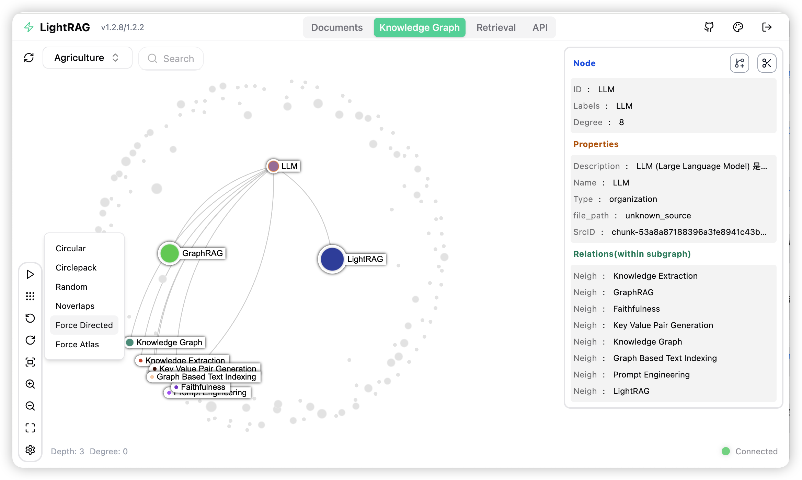

<div align="center">

<div style="margin: 20px 0;">
  
</div>

# Mindage

### Mind Map Driven Knowledge Graph & Article Generation Platform

### 思维导图驱动的知识图谱与文章生成平台

<p>
  
  
  
  
</p>

<p>
  <a href="#english"></a>
  <a href="#中文"></a>
</p>

</div>

---

<br>

<a id="english"></a>
<div align="center">
  <h1>🇺🇸 English</h1>
</div>

**Mindage** is an interactive knowledge platform built on top of [LightRAG](https://github.com/HKUDS/LightRAG). It transforms traditional retrieval-augmented generation into an exploratory experience — navigate knowledge through mind maps, generate structured articles from topic trees, and extend capabilities through MCP tool integration.

### ✨ Key Features

- **Mind Map Exploration** — Canvas-based interactive mind maps powered by LLM. Expand topics, generate per-node content, and produce full structured articles from a single topic tree.
- **Knowledge Graph Visualization** — Interactive graph visualization of entity relationships extracted from your documents, powered by Sigma.js.
- **Multi-Mode Retrieval** — Five query modes (local, global, hybrid, mix, naive) to balance precision and breadth for different query types.
- **MCP Tool Integration** — Connect external tools via Model Context Protocol (stdio / SSE / streamable HTTP) and invoke them during conversations.
- **PageIndex Tree Index** — Hierarchical document tree index for structured navigation of processed documents.
- **Multi-User RBAC** — JWT-based authentication with admin / user / guest roles and self-service password management.
- **Multi-Workspace** — Create isolated knowledge bases with separate document sets and knowledge graphs.
- **11 Languages** — Full internationalization via i18next including Chinese, English, Japanese, Korean, French, German, Spanish, and more.
- **Observability** — Prometheus metrics, request tracing, and structured JSON logging for production monitoring.

### 📸 Screenshots

<div align="center">
  
</div>

### 🚀 Quick Start

#### Prerequisites

- Python 3.10+
- Node.js 18+ & [Bun](https://bun.sh/)
- [uv](https://docs.astral.sh/uv/) (recommended for Python package management)

#### Install from Source

```bash
git clone https://github.com/RangerCao/LightRAG.git
cd LightRAG

# Set up Python environment
uv sync --extra api
source .venv/bin/activate        # Linux/macOS
# .venv\Scripts\activate         # Windows

# Build WebUI
cd lightrag_webui
bun install --frozen-lockfile
bun run build
cd ..

# Configure environment
cp env.example .env
# Edit .env with your LLM and embedding API keys

# Start the server
lightrag-server
```

#### Docker Deployment

```bash
git clone https://github.com/RangerCao/LightRAG.git
cd LightRAG
cp env.example .env
# Edit .env with your configurations
docker compose -f docker-compose-full.yml up -d
```

The full Docker stack includes: Mindage server, vLLM embedding/reranking services, PostgreSQL (pgvector), Neo4j graph database, and Milvus vector database.

#### Access Mindage

Once running, open your browser:

- **WebUI**: `http://localhost:9621/webui/`
- **API Docs**: `http://localhost:9621/docs`
- **Health Check**: `http://localhost:9621/health`

### ⚙️ Configuration

Mindage is configured via environment variables in the `.env` file. Key settings:

| Variable | Description | Default |
|----------|-------------|---------|
| `LLM_BINDING` | LLM provider (openai / ollama / azure) | `openai` |
| `LLM_MODEL` | LLM model name | `gpt-4o-mini` |
| `EMBEDDING_BINDING` | Embedding provider | `openai` |
| `EMBEDDING_MODEL` | Embedding model name | `text-embedding-3-small` |
| `SUMMARY_LANGUAGE` | Output language for entities/relations | `English` |
| `ENABLE_PAGEINDEX` | Enable tree index feature | `false` |
| `MAX_PARALLEL_INSERT` | Max documents processed in parallel | `3` |

See `env.example` for the complete configuration reference.

### 🏗️ Architecture

```
Mindage
├── lightrag/              # Core Python package
│   ├── api/               # FastAPI server + REST endpoints
│   │   ├── routers/       # Document, query, graph, explore, MCP routes
│   │   └── lightrag_server.py
│   ├── kg/                # Storage backends (Neo4j, PostgreSQL, Milvus, etc.)
│   ├── llm/               # LLM providers (OpenAI, Ollama, Azure, etc.)
│   ├── parser/            # Document parsers (native, MinerU, Docling)
│   ├── chunker/           # Chunking strategies
│   ├── pipeline.py        # Document ingestion pipeline
│   └── operate.py         # Extraction & retrieval operations
├── lightrag_webui/        # React 19 + TypeScript frontend
│   └── src/
│       ├── components/    # UI components
│       ├── views/         # Page views (Chat, Knowledge, Graph, MindMap...)
│       └── i18n/          # 11 language translations
└── docker-compose-full.yml
```

### 🙏 Acknowledgments

Mindage is built on top of [LightRAG](https://github.com/HKUDS/LightRAG) by HKUDS. We gratefully acknowledge the original project's foundational contributions to graph-based retrieval-augmented generation.

If you use Mindage in your research, please cite the original LightRAG paper:

```bibtex
@article{guo2024lightrag,
  title={LightRAG: Simple and Fast Retrieval-Augmented Generation},
  author={Zirui Guo and Lianghao Xia and Yanhua Yu and Tu Ao and Chao Huang},
  year={2024},
  eprint={2410.05779},
  archivePrefix={arXiv},
  primaryClass={cs.IR}
}
```

<br>

---

<br>

<a id="中文"></a>
<div align="center">
  <h1>🇨🇳 中文</h1>
</div>

**Mindage** 是一个基于 [LightRAG](https://github.com/HKUDS/LightRAG) 构建的交互式知识平台。它将传统的检索增强生成转化为一种探索式体验——通过思维导图导航知识、从主题树生成结构化文章，并通过 MCP 工具集成扩展能力。

### ✨ 核心功能

- **思维导图探索** — 基于 Canvas 的交互式思维导图，由 LLM 驱动。展开主题、生成节点内容、从单一主题树生成完整的结构化文章。
- **知识图谱可视化** — 基于 Sigma.js 的交互式图谱，展示从文档中提取的实体关系网络。
- **多模式检索** — 五种查询模式（局部、全局、混合、融合、朴素），在不同查询场景下平衡精确度与广度。
- **MCP 工具集成** — 通过 Model Context Protocol（stdio / SSE / streamable HTTP）连接外部工具，在对话中直接调用。
- **PageIndex 树形索引** — 层级化文档树索引，支持结构化浏览已处理文档。
- **多用户权限管理** — 基于 JWT 的认证系统，支持管理员 / 普通用户 / 访客三种角色，支持自助修改密码。
- **多工作空间** — 创建隔离的知识库，每个空间拥有独立的文档集和知识图谱。
- **11 种语言** — 基于 i18next 的完整国际化支持，包括中文、英文、日文、韩文、法语、德语、西班牙语等。
- **可观测性** — Prometheus 指标、请求追踪和结构化 JSON 日志，满足生产环境监控需求。

### 🚀 快速开始

#### 环境要求

- Python 3.10+
- Node.js 18+ 和 [Bun](https://bun.sh/)
- [uv](https://docs.astral.sh/uv/)（推荐的 Python 包管理工具）

#### 从源码安装

```bash
git clone https://github.com/RangerCao/LightRAG.git
cd LightRAG

# 配置 Python 环境
uv sync --extra api
source .venv/bin/activate        # Linux/macOS
# .venv\Scripts\activate         # Windows

# 构建前端
cd lightrag_webui
bun install --frozen-lockfile
bun run build
cd ..

# 配置环境变量
cp env.example .env
# 编辑 .env，填入你的 LLM 和 Embedding API 密钥

# 启动服务
lightrag-server
```

#### Docker 部署

```bash
git clone https://github.com/RangerCao/LightRAG.git
cd LightRAG
cp env.example .env
# 编辑 .env 配置文件
docker compose -f docker-compose-full.yml up -d
```

完整 Docker 技术栈包括：Mindage 服务、vLLM 嵌入/重排服务、PostgreSQL (pgvector)、Neo4j 图数据库和 Milvus 向量数据库。

#### 访问 Mindage

启动后，在浏览器中打开：

- **WebUI**：`http://localhost:9621/webui/`
- **API 文档**：`http://localhost:9621/docs`
- **健康检查**：`http://localhost:9621/health`

### ⚙️ 配置说明

Mindage 通过 `.env` 文件中的环境变量进行配置。主要设置项：

| 变量 | 说明 | 默认值 |
|------|------|--------|
| `LLM_BINDING` | LLM 提供商（openai / ollama / azure） | `openai` |
| `LLM_MODEL` | LLM 模型名称 | `gpt-4o-mini` |
| `EMBEDDING_BINDING` | 嵌入模型提供商 | `openai` |
| `EMBEDDING_MODEL` | 嵌入模型名称 | `text-embedding-3-small` |
| `SUMMARY_LANGUAGE` | 实体/关系输出语言 | `English` |
| `ENABLE_PAGEINDEX` | 启用树形索引功能 | `false` |
| `MAX_PARALLEL_INSERT` | 最大并行处理文档数 | `3` |

完整配置请参考 `env.example` 文件。

### 🏗️ 项目架构

```
Mindage
├── lightrag/              # Python 核心包
│   ├── api/               # FastAPI 服务 + REST 接口
│   │   ├── routers/       # 文档、查询、图谱、探索、出行、MCP 路由
│   │   └── lightrag_server.py
│   ├── kg/                # 存储后端（Neo4j、PostgreSQL、Milvus 等）
│   ├── llm/               # LLM 提供商（OpenAI、Ollama、Azure 等）
│   ├── parser/            # 文档解析器（native、MinerU、Docling）
│   ├── chunker/           # 分块策略
│   ├── pipeline.py        # 文档摄入流水线
│   └── operate.py         # 抽取与检索操作
├── lightrag_webui/        # React 19 + TypeScript 前端
│   └── src/
│       ├── components/    # UI 组件
│       ├── views/         # 页面视图（对话、知识、图谱、思维导图、出行...）
│       └── i18n/          # 11 种语言翻译
└── docker-compose-full.yml
```

### 🙏 致谢

Mindage 基于 HKUDS 的 [LightRAG](https://github.com/HKUDS/LightRAG) 项目构建。我们诚挚感谢原项目在基于图谱的检索增强生成领域的基础性贡献。

如果您在研究中使用了 Mindage，请引用 LightRAG 原始论文：

```bibtex
@article{guo2024lightrag,
  title={LightRAG: Simple and Fast Retrieval-Augmented Generation},
  author={Zirui Guo and Lianghao Xia and Yanhua Yu and Tu Ao and Chao Huang},
  year={2024},
  eprint={2410.05779},
  archivePrefix={arXiv},
  primaryClass={cs.IR}
}
```

---

<div align="center">
  <sub>Built with ❤️ on top of <a href="https://github.com/HKUDS/LightRAG">LightRAG</a></sub>
</div>
